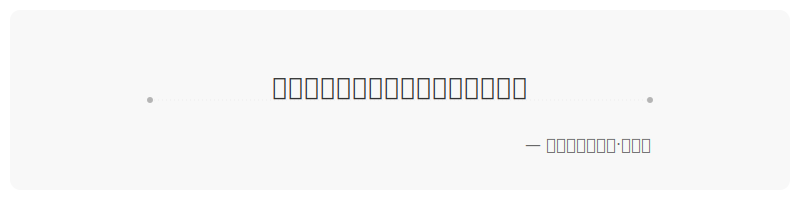

<div align="center">
  <!-- dynamic typing effect 动态打字效果 -->
  <div>
    <a href="https://yey.world/">
      
    </a>
  </div>
</div>

<a href="https://cdn-images-1.medium.com/v2/resize:fit:720/0*41inHKnPhGb04HsO.gif">
  
</a>

### Hello World! I am <b>YEY<a target="_blank" href="javascript:;"></a></b>

- 🧠 Researching LLMs and generative AI with a vision towards AGI
- 🔬 Developing innovative AI algorithms for complex real-world problems
- 📚 Embracing lifelong learning in the rapidly evolving field of AI

<p align="left">
<a href="https://yey.world">
    </a>
<a href="https://github.com/YEY11"></a>
<a href="https://wakatime.com/@8e1088c8-85c7-4b24-abde-dc6f9fd0a008"></a>
</p>
<br/>
<br/>
<br/>

You are my th visitor

---

<!-- GitHub 贪吃蛇动画 -->
<picture>
  <source
    media="(prefers-color-scheme: dark)"
    srcset="https://raw.githubusercontent.com/YEY11/YEY11/output/github-snake-dark.svg"
  />
  <source
    media="(prefers-color-scheme: light)"
    srcset="https://raw.githubusercontent.com/YEY11/YEY11/output/github-snake.svg"
  />
  
</picture>

### 🛠️ Skills

<p align="center">
  <a href="https://skillicons.dev">
    <!-- 编程语言和框架 -->
    
  </a>
</p>
<p align="center">
  <a href="https://skillicons.dev">
    <!-- 工具、平台和基础设施 -->
    
  </a>
</p>

<!-- https://github.com/badges/shields -->
<p align="center">
<a href="https://github.com/YEY11"></a>
<a href="https://yey.world"></a>
<a href="https://www.linkedin.com/in/yey11/"></a>
<a href="https://yey11.github.io/YEY11/wechat.html" target="_blank"></a>
<a href="mailto:yangye0329@outlook.com"></a>
</p>

---

### 🧑‍💻 Experience

<div>
  
  <div>
    <strong>Machine Learning Engineer (LLMs & Generative AI)</strong><br/>
    <em>Shanghai Jiao Tong University · Chongqing Institute of AI</em> &nbsp;&nbsp;|&nbsp;&nbsp; Nov 2023 - Present<br/>
    Specializing in LLM fine-tuning, AIGC productization, and AI solutions for industry applications.
  </div>
</div>

<br clear="left"/>
<br/>

<div>
  
  <div>
    <strong>Software Engineer (ML & AI Applications)</strong><br/>
    <em>Huawei · Wuhan Research Center</em> &nbsp;&nbsp;|&nbsp;&nbsp; Dec 2021 - Nov 2023<br/>
    Developed intelligent network systems using graph algorithms, causal learning, and LLM-powered AIOps solutions.
  </div>
</div>

<br clear="left"/>
<br/>

<div>
  
  <div>
    <strong>Research Assistant (ML & Database Systems)</strong><br/>
    <em>University of Melbourne · Learning Index Group</em> &nbsp;&nbsp;|&nbsp;&nbsp; Aug 2020 - Jul 2021<br/>
    Researched updateable learned index structures with superior performance to traditional indexing structures.
  </div>
</div>

<br clear="left"/>

---

### 👾 About My Github

<div align="center">
  <table style="width:100%;">
    <tr>
      <!-- 第一个图片 -->
      <td align="center">
        
      </td>
      <!-- 第二个图片 -->
      <td align="center">
        
      </td>
    </tr>
    <!-- 第三个图片 -->
    <tr>
      <td colspan="2" align="center">
        
      </td>
    </tr>
  </table>
</div>

---

### 🚀 WakaTime


<!--START_SECTION:waka-->


**🐱 My GitHub Data** 

> 📦 135.4 kB Used in GitHub's Storage 
 > 
> 🚫 Not Opted to Hire
 > 
> 📜 103 Public Repositories 
 > 
> 🔑 7 Private Repositories 
 > 
**I'm a Night 🦉** 

```text
🌞 Morning                14 commits          █░░░░░░░░░░░░░░░░░░░░░░░░   05.13 % 
🌆 Daytime                53 commits          █████░░░░░░░░░░░░░░░░░░░░   19.41 % 
🌃 Evening                108 commits         ██████████░░░░░░░░░░░░░░░   39.56 % 
🌙 Night                  98 commits          █████████░░░░░░░░░░░░░░░░   35.90 % 
```
📅 **I'm Most Productive on Wednesday** 

```text
Monday                   16 commits          █░░░░░░░░░░░░░░░░░░░░░░░░   05.86 % 
Tuesday                  49 commits          ████░░░░░░░░░░░░░░░░░░░░░   17.95 % 
Wednesday                112 commits         ██████████░░░░░░░░░░░░░░░   41.03 % 
Thursday                 75 commits          ███████░░░░░░░░░░░░░░░░░░   27.47 % 
Friday                   10 commits          █░░░░░░░░░░░░░░░░░░░░░░░░   03.66 % 
Saturday                 9 commits           █░░░░░░░░░░░░░░░░░░░░░░░░   03.30 % 
Sunday                   2 commits           ░░░░░░░░░░░░░░░░░░░░░░░░░   00.73 % 
```


📊 **This Week I Spent My Time On** 

```text
🕑︎ Time Zone: Asia/Shanghai

💬 Programming Languages: 
Python                   31 mins             ███████████████░░░░░░░░░░   58.48 % 
JSON                     21 mins             ██████████░░░░░░░░░░░░░░░   41.34 % 
HTML                     0 secs              ░░░░░░░░░░░░░░░░░░░░░░░░░   00.18 % 

🔥 Editors: 
VS Code                  53 mins             █████████████████████████   100.00 % 

🐱‍💻 Projects: 
VideoDataset             23 mins             ███████████░░░░░░░░░░░░░░   44.35 % 
filetest                 12 mins             ██████░░░░░░░░░░░░░░░░░░░   24.26 % 
Unknown Project          9 mins              ████░░░░░░░░░░░░░░░░░░░░░   17.00 % 
阶段1：大模型顶尖架构原理精讲          7 mins              ████░░░░░░░░░░░░░░░░░░░░░   14.39 % 

💻 Operating System: 
Mac                      53 mins             █████████████████████████   100.00 % 
```

**I Mostly Code in Python** 

```text
Python                   9 repos             █████████████░░░░░░░░░░░░   52.94 % 
Jupyter Notebook         3 repos             ████░░░░░░░░░░░░░░░░░░░░░   17.65 % 
Java                     2 repos             ███░░░░░░░░░░░░░░░░░░░░░░   11.76 % 
HTML                     2 repos             ███░░░░░░░░░░░░░░░░░░░░░░   11.76 % 
C#                       1 repo              █░░░░░░░░░░░░░░░░░░░░░░░░   05.88 % 
```


 Last Updated on 22/04/2025 00:57:07 UTC
<!--END_SECTION:waka-->

---

### 🌙 Odyssey

<p align="center">
  
</p>

<p align="center">

</p>
